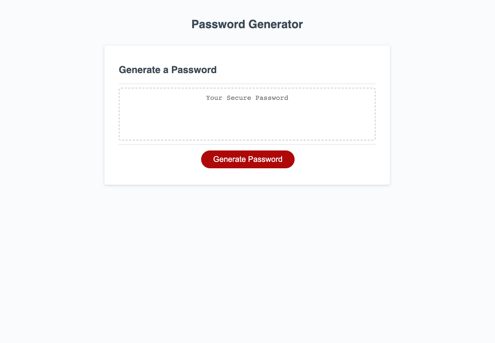

# Password-Generator

## Description 

This [Password Generating Website](mattdack.github.io/password-generator) allows the user to create randomized passwords based on a number of entry criteria. I.E. how long should the password be? Should it include lower case, uppercase, numbers, or special characters? The website uses prompts to collect this information, store in variables, and utilizes it to create a password according to user criteria.

## Screenshot of Webpage

## Installation

There is no installation required or capable with this repository. Running the index.html file in a default browser renders a static webpage that is identical to the one found at [here](mattdack.github.io/password-generator).

## Usage 

Select the generate password button to initiate prompts to create password. Use Okay as an affirmative and use cancel as a negative to answer questions

## Credits

The majority of the code for this project was provided by Trilogy in collaboration with the University of Washington. Matthew Dacanay wrote 99% of the javascript, created the functionality of the webpage, tested edge cases, and provided user-prompt text. You can find other projects by Matthew at his [github page](github.com/mattdack).
